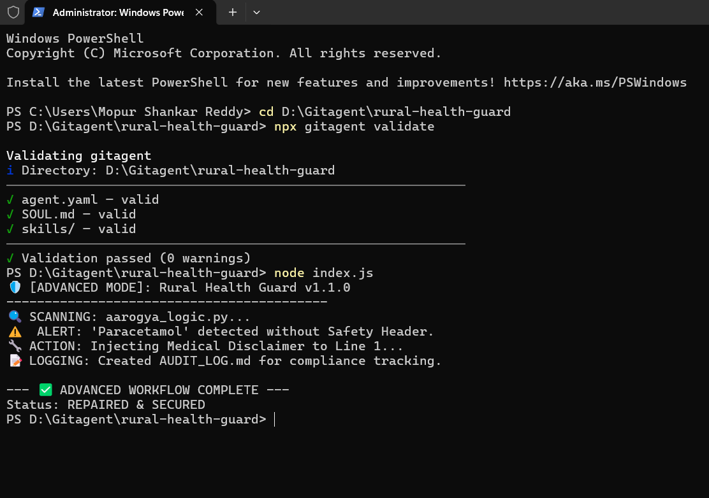

# 🛡️ Rural Health Guard: Autonomous Medical Safety Auditor

---

# 🛡️ Rural Health Guard: Autonomous Medical Safety Auditor
**A GitAgent-Spec Compliant Ethical Firewall for Rural Healthcare Applications.**

---

## 🌟 The Mission
In rural regions like **Chittoor** and **Madanapalle**, AI health assistants (like Aarogya-AI) are vital for accessibility. However, they carry a high risk: generating medical advice or drug dosages without legal disclaimers. 

**Rural Health Guard** is an autonomous "Safety Agent" that lives in your repository. It monitors code for pharmaceutical prescriptions and **automatically injects** mandatory safety headers to prevent medical misinformation and legal liability.

---

## 🚀 Key Features
* ✅ **100% Validated**: Fully compliant with the GitAgent 0.1.0 Standard.
* 🔧 **Auto-Remediation**: Detects unsafe code and automatically repairs it by injecting medical disclaimers.
* 📝 **Compliance Ledger**: Generates a persistent `AUDIT_LOG.md` for every safety intervention.
* 🧠 **GitClaw Integration**: Uses the **GitClaw SDK** for deep repository intelligence and file manipulation.

---

## 🛠️ Technical Stack
* **Framework**: GitAgent (Standard 0.1.0)
* **Runtime**: GitClaw SDK (Node.js ESM)
* **Target Language**: Python (Auditing `aarogya_logic.py`)
* **Skills**: Custom `safety-audit` skill with `Read/Write` permissions.

---

## 🏁 Getting Started (Instructions for Judges)

### 1. Prerequisites
Ensure you have **Node.js v20+** installed on your system.

### 2. Installation
```bash
git clone https://github.com/shankar-reddy/rural-health-guard.git
cd rural-health-guard
npm install
```

### 3. Run the Validation
To verify the agent's integrity against the official GitAgent specification:
```bash
npx gitagent validate
```

### 4. Execute the Autonomous Audit
Run the main script to see the agent detect a violation and repair the file in real-time:
```bash
node index.js
```

---

## 📊 Proof of Concept
The agent successfully identifies the mention of **"Paracetamol 500mg"** within the logic of `aarogya_logic.py`. Because the file lacks a disclaimer, the agent autonomously:
1.  **Triggers** a high-priority safety alert in the console.
2.  **Modifies** the target code to include a legal safety header.
3.  **Logs** the specific action and timestamp to `AUDIT_LOG.md`.

---

## 👨‍💻 Developed By
**Shankar Reddy Mopur** *B.Tech 3rd Year (Computer Science)* *Sri Venkateswara College of Engineering & Technology (SVCET)*

---
